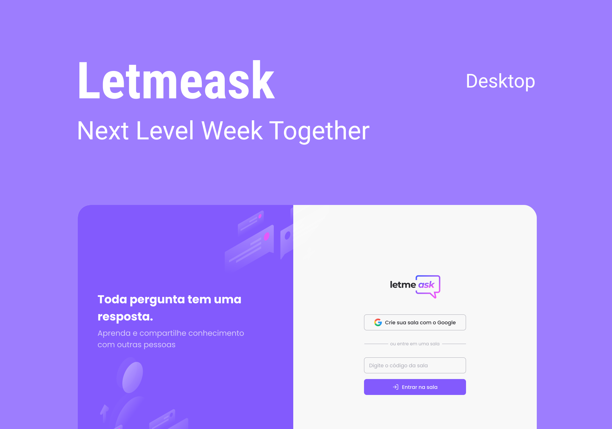

<h1 align="center">
    
    
</h1>

<p align="center">
  <a href="#technologies">Technologies</a>&nbsp;&nbsp;&nbsp;|&nbsp;&nbsp;&nbsp;
  <a href="#-layout">Getting started</a>&nbsp;&nbsp;&nbsp;|&nbsp;&nbsp;&nbsp;
  <a href="#-project">Project</a>&nbsp;&nbsp;&nbsp;|&nbsp;&nbsp;&nbsp;
  <a href="#-layout">Layout</a>&nbsp;&nbsp;&nbsp;|&nbsp;&nbsp;&nbsp;
  <a href="#-license">License</a>
</p>

<p align="center">
  
  
  

  
</p>


<p align="center">
  
</p>

## 🧪 Technologies

This project was developed using the following technologies:

- [React](https://reactjs.org/)
- [Firebase](https://firebase.google.com)
- [Sass](https://sass-lang.com/)
- [TypeScript](https://www.typescriptlang.org/)

## 💻 Starting the project

### Prerequisites

It is necessary to have installed on your machine to execute this project:
- [Git](https://git-scm.com)
- [NodeJS](https://nodejs.org/)
- [Gerenciador de pacotes](https://www.npmjs.com)
    - [Yarn](https://classic.yarnpkg.com/en/docs/install/#windows-stable)

### ⌨ Downloading the project

```bash
# Clone the Repository
$ git clone https://github.com/VitorFirmino/NLW-6.git

# Access the project folder
$ cd NLW-6
```

### 🗄️ Configuring the server
```bash

# Install the dependencies
$ yarn

# Start the project
$ yarn start
```

## 💻 Project


This is a project developed during the **[Next Level Week](https://nextlevelweek.com/)**, presented by **[@Rocketseat](https://github.com/Rocketseat)** during June 20-27, 2021.

## 🔖 Layout

You can view the project layout through the links below:

- [Layout Web](https://www.figma.com/file/eJAtgqHbwtLSJVxoQDjVPB/Letmeask-node-id=45%3A29835)

Remembering that you need to have a [Figma](http://figma.com/) account to access it.

## 📝 License

This project is licensed under the MIT License. See the [LICENSE](LICENSE.md) file for details.

---
